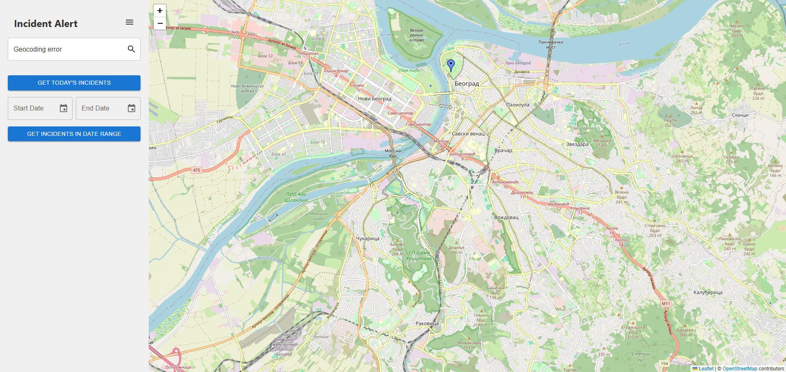

<div align="center">

# 📍 Incident Alert Frontend


<picture>
    <source srcset="readme_assets/demo.gif" type="image/gif">
    
</picture>

</div>

---

## 📌 Project Overview

**Incident Alert Frontend** is the user-facing React application for reporting and viewing incidents on an interactive map. Users can submit new incidents, browse existing ones, and filter by date — all powered by Leaflet and OpenStreetMap.

---

## ✨ Features

- 🗺️ **Interactive Map** — Report and view incidents on a dynamic Leaflet/OpenStreetMap interface
- 📋 **Incident Reporting** — Submit new incidents with title, description, category, and location
- 📅 **Date Filtering** — Filter incidents by current day or custom date range
- 📍 **Geolocation** — Automatic location detection for faster incident reporting
- 🌐 **Google Translate** — Incident description translation support
- 🔍 **Location Search** — Search for specific places via Google Places API

---

## 🛠️ Tech Stack

| Technology | Usage |
|------------|-------|
| React | Frontend framework |
| Redux | State management |
| Leaflet / OpenStreetMap | Interactive map (no API key required) |
| Axios | HTTP client |
| Docker + Nginx | Containerized deployment |

---

## 🚀 Setup & Run

### Prerequisites
- Docker and Docker Compose
- Backend services running (see [IncidentAlert](https://github.com/pero-grubac/IncidentAlert))

### 1. Clone the repository
```bash
git clone https://github.com/pero-grubac/IncidentAlertFrontend.git
cd IncidentAlertFrontend
```

### 2. Configure environment

Set backend URL in `src/environments/config.production.json`:
```json
{
  "baseServiceUrl": "http://localhost:5000",
  "REACT_APP_GOOGLE_API_KEY": ""
}
```

> Google API key is optional — map works without it. Only Places autocomplete and Translate require it.

### 3. Run with Docker
```bash
docker compose up -d --build
```

App will be available at `http://localhost:3000`.